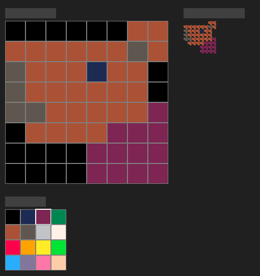
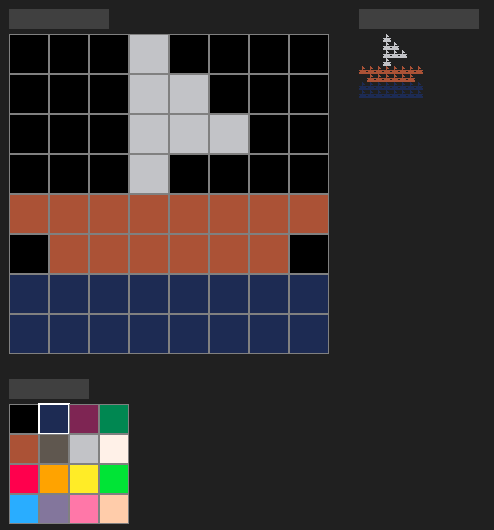
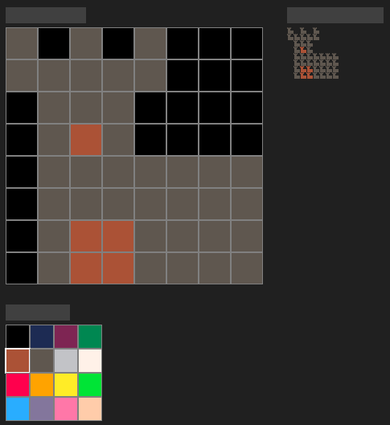
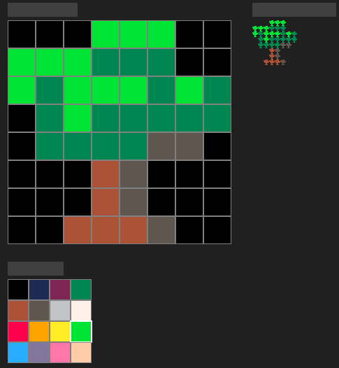

# PixelRecursor

A recursive pixel art editor written in C++ with SDL2, compilable to WebAssembly using Emscripten.

This is an educational example of a compiled C++ graphic application which runs in the browser (WebAssembly) or as a traditional native executable.

It demonstrates a rendering technique that is elegantly implemented in C++ with SDL2, but would be significantly more complex to reproduce in other environments such as JavaScript with HTML5 Canvas or WebGL.

In JavaScript, canvas drawing is immediate-mode and does not retain structural information about what was drawn. There are no persistent "pixel entities" that can be transformed recursively without manually maintaining the entire rendering state. In contrast, in C++/SDL2, it is trivial to maintain and reuse image state in memory — which makes recursive rendering like this straightforward.

## Demo

https://gmrodrigues.github.io/rpixed/


## Screenshots

  
  




## Features

- **8x8 Pixel Editor**: Click to draw with your mouse on an 8x8 grid
- **16-Color Palette**: PICO-8 inspired color palette with visual selection
- **Recursive Visualization**: Each pixel in your 8x8 design becomes a copy of the entire image, creating a 64x64 recursive pattern
- **Cross-Platform**: Runs natively on desktop or in web browsers via WebAssembly
- **Minimal Dependencies**: Only uses SDL2, no external libraries

## Controls

- **Left Click**: Paint pixels in the editor grid or select colors from the palette
- **C Key**: Clear the entire canvas
- **Mouse**: Navigate between the editor grid and color palette

## More on WebAssembly

In WebAssembly (WASM), your compiled C++ application runs inside a lightweight virtual machine embedded in the browser. Unlike JavaScript, which operates in a higher-level, event-driven runtime with limited low-level control, WebAssembly gives you direct access to a linear block of memory — essentially a flat address space — and a predictable execution model.

This means your program can manage its own memory, structures, and state just like a native application. You can allocate buffers, use pointers, cache data, and represent your world in RAM however you choose. This is ideal for graphics applications like this one, where pixel data, palette state, and recursive rendering logic benefit from direct memory access and structure-oriented design.

JavaScript, by contrast, doesn't expose this kind of memory model. Its canvas API is stateless — once you draw, the state is lost unless you track it yourself. This makes recursive or data-driven visual algorithms far more cumbersome to implement in JS than in a WASM-backed C++ application.


## Building

### Prerequisites

#### For Native Build:
- CMake 3.16+
- SDL2 development libraries
- C++17 compatible compiler

**Ubuntu/Debian:**
```bash
sudo apt-get install libsdl2-dev cmake build-essential
```

**Fedora:**
```bash
sudo dnf install SDL2-devel cmake gcc-c++
```

**Arch Linux:**
```bash
sudo pacman -S sdl2 cmake gcc
```

#### For Web Build:
- [Emscripten SDK](https://emscripten.org/docs/getting_started/downloads.html)

### Building for Desktop

```bash
./build_native.sh
cd build_native
./pixelrecursor
```

### Building for Web

```bash
# Make sure Emscripten is activated
source /path/to/emsdk/emsdk_env.sh

./build_emscripten.sh
cd web
python3 -m http.server 8000
```

Then open `http://localhost:8000` in your browser.

## Project Structure

```
├── src/
│   ├── main.cpp              # Main application and SDL setup
│   ├── PixelEditor.h/.cpp    # 8x8 pixel grid editor
│   ├── Palette.h/.cpp        # 16-color palette management
│   └── RecursiveRenderer.h/.cpp # Recursive visualization renderer
├── assets/                   # Asset directory (currently empty)
├── CMakeLists.txt           # Build configuration
├── build_native.sh          # Native build script
├── build_emscripten.sh      # Web build script
└── README.md               # This file
```

## How It Works

1. **Editor Grid**: The main 8x8 grid where you create your pixel art
2. **Color Palette**: 16 predefined colors in a 4x4 grid for selection
3. **Recursive Display**: The 64x64 output where each "pixel" of your 8x8 design is replaced by the entire 8x8 image, creating a fractal-like recursive pattern

## Technical Details

- **Language**: C++17
- **Graphics**: SDL2 for cross-platform rendering
- **Build System**: CMake with Emscripten support
- **Web Target**: WebAssembly (WASM) with HTML5 Canvas
- **Architecture**: Component-based design with separate classes for editing, palette, and rendering

## Future Enhancements

- PNG export functionality using Emscripten file APIs
- Multiple levels of recursion (recursive recursion!)
- Undo/redo functionality
- Save/load project files
- Animation support
- Custom palette editing

## License

This project is open source. Feel free to modify and distribute.

## Contributing

Contributions are welcome! Please feel free to submit pull requests or open issues for bugs and feature requests.
# recursive-pixel-editor
